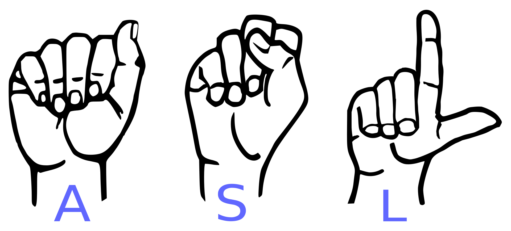
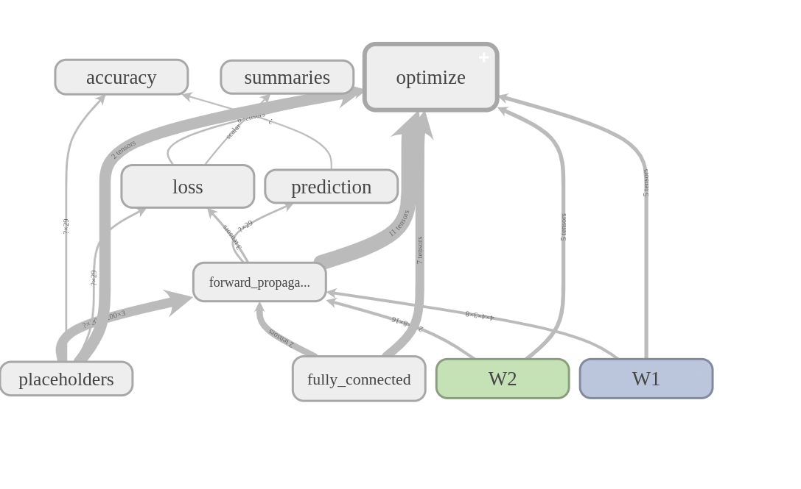

# American Sign Language Classification
[Wikipedia] American Sign Language (ASL) is a natural language that serves as the predominant sign language of Deaf communities in the United States and most of Anglophone Canada. Besides North America, dialects of ASL and ASL-based creoles are used in many countries around the world, including much of West Africa and parts of Southeast Asia. ASL is also widely learned as a second language, serving as a lingua franca.

### Data

To Download the ASL dataset -
   * Click on the link given - https://www.kaggle.com/grassknoted/asl-alphabet
   * Click on the link given - https://facundoq.github.io/unlp/sign_language_datasets/index.html
   
   
## Getting Started

We will be using Python and Tensorflow to build model to classify signs ASL. The tensorflow graph of the architecture can be shown as:

### CNN Architecture
* Input
*  ⇊
* Convolution layer: 4x4 kernel , 8 filters
* Maxpooling: pool size – 8x8
* Convolution layer: 2x2 kernel , 16 filters 
* Maxpooling: pool size – 4x4
* Flatten
* Fully Connected

## Authors

* **Mrityunjay Tripathi** - [*LinkedIn Profile*](https://www.linkedin.com/in/mrityunjay-tripathi-89a243168/)

## License

This project is licensed under the Apache 2.0 License - see the [License](https://github.com/Mrityunjay2668/American-Sign-Language-Classification/blob/master/LICENSE) file for details.
